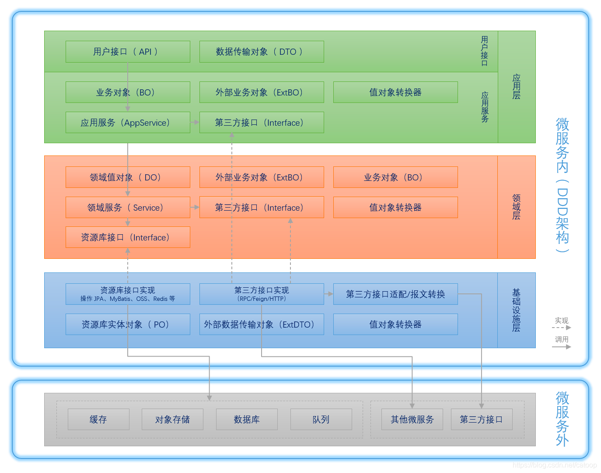
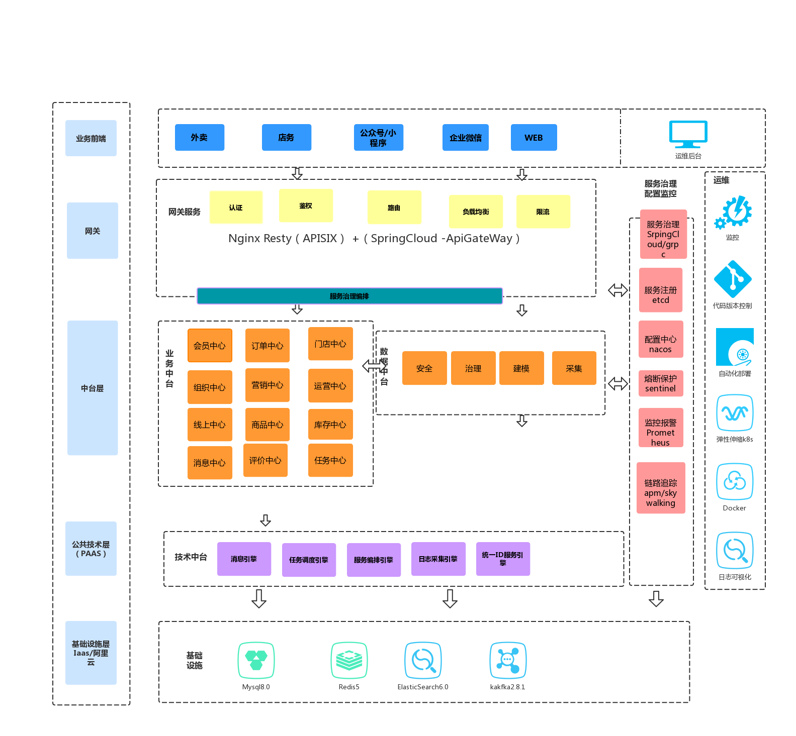

## 工程结构

### DDD 四层结构

可用cola ，本文档建议的规范更多的是二级目录。

Infrastructure(基础实施层)，Domain(领域层)，Application(应用层)，Interfaces(表示层，也叫用户界面层或是接口层)

### 规则建议

### demo-interfaces:

可以进一步拆分，但是项目前期建议还是不要拆的过度细。

备注：公司内部通信与交付给第三方可以讨论下，是否需要有单独rpc层，挑战是，涉及对方必须使用
我们内部协议。

+ 拆分建议原则：
  + 对外（http）：demo-adapter 
  + 内部（rpc） : demo-client 

### demo-app:

+ 关心处理完一个完整的业务
+ 该层只负责业务编排，对象转换，实际业务逻辑由领域层完成
+ 不关心【请求从何处来】，但是关心【谁来、做什么、有没有权限做】
+ 即复制安全认证、权限校验
+ 集成不同的领域服务解决问题
+ 应用层位于领域层之上，因为领域层包含多个聚合，所以它可协调多个聚合服务和领域对象完成服务编排和组合，协作完成业务。
+ 最终一致性（最终一致性对业务有侵入）事务放到这层
+ 对应到分布式系统中的中台等概念
+ 方法级别的功能权限控制放到这层
+ 只产应用异常，对应 HTTP 状态码 403、401

#### 基本功能
+ 发送或订阅领域事件
+ 状态机即其他设计模式/分布式队列。
+ 跨多个服务的组合。 单个服务，也可以直接调用domain-service

### demo-domain:

聚合根，实体，领域事件，仓库服务（纯接口），服务，值对象

### demo-Infrastructure

主要存放基础资源服务相关的代码，为其它各层提供的通用技术能力、三方软件包、数据库服务、配置和基础资源服务的代码都会放在这一层目录里。

## 版本建议

JDK ： 8/11 （客户如果是大内存服务器，建议直接11）

SpringBoot2.2+    基础组件

Redis 6.0+ (或5.0) (redission 3.11.6+) 缓存

ES 7.0+  搜索引擎

MongoDB(可选) 

Mysql7.0(GEO支持比较好)  业务存储

Kafka 3.1  消息中心
https://spring.io/projects/spring-kafka

Camel  服务编排

ant-design-react 4.0+

## 数据规约

建议表命名，核心模块_实体名（全部小写） 不易过长。

不要过多列，modifyTime，createTime，都用时间戳，建议用LocalDateTime
日期，date -> LocalDate
尽量不要用datetime

公用的字段，尽量统一命名，可在工具类里定义通用实体。

其余规范参考 《阿里开发者手册》

### 数据字典

核心领域通用定义
核心数据字典整理

###  技术方案TODO

+ 工程结构 (待评审)
+ 链路追踪 （已有- 需讨论讨论确定）
+ RPC （已明确）
+ 日志规范 （已明确-需讨论 ）
+ 统一业务术语（数据库字段/领域语言）（需讨论，需长期有共享空间）
+ IT/运维 （已明确）

### 其他建议规范
能用公司统一的，就用公司统一。
例如：服务治理，服务监控，服务注册，链路追踪

##### 建议约束：
错误码：
所有通用的错误码，应该保持一致。类似：401 授权失败，402 电话授权失败，403 unionId授权失败
10000 参数错误。  
其余错误码，建议用5位数字表示。
日志需要把错误码打印到日志文件。

RedisKey：模块缩写:领域实体：{具体key} 公司有规范，继承公司规范。

## 整体技术方案

